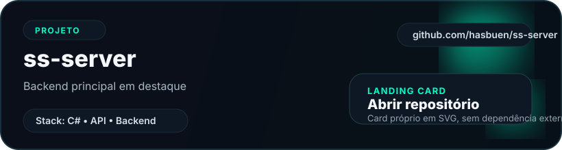
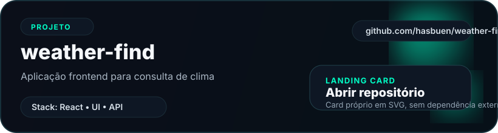
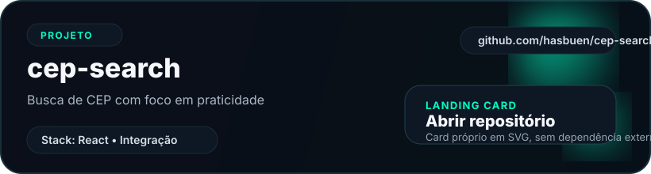

<h1 align="center">Olá, seja bem-vindo! 👋</h1>

  

  

## :pushpin: Sobre mim

- 💻 Experiência sólida em **relacionamento com cliente à distância** e **colaboração em equipe**
- 🚀 Atuei como **implementador de soluções empresariais** na **Linx S.A.**
- 🛠️ Mais de **5 anos em HelpDesk**
- ✏️ **31 anos**

---

## ⚡ Habilidades Técnicas

### Linguagens

  
  
  
  
  

### Front-end & Frameworks

  
  
  
  

---

## 📌 Projetos em Destaque

### Backend

  

### Frontend

  

  

  

---

## 🎯 Competências Pessoais

- 🧘 Paciência e foco em resultados
- 🎨 Criatividade aplicada à resolução de problemas
- 🤝 Colaboração e comprometimento
- 🔄 Adaptabilidade em diferentes cenários

---

## 🌐 Conecte-se

  
  

---

  

